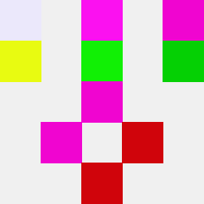
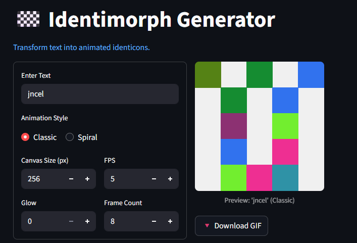

# Identimorph 

[**Identimorph**]() is a tool that creates animated identicons from text using hash-based pixel symmetry. See the example below.

  
_identimorph of 'jncel' string_

## Features

- Input string — such as names, URLs, hashes, code snippets etc.
- Tweak canvas size, frame counts, speed, and minor glow effect.
- Save the identimorph as GIF.

## Demo

